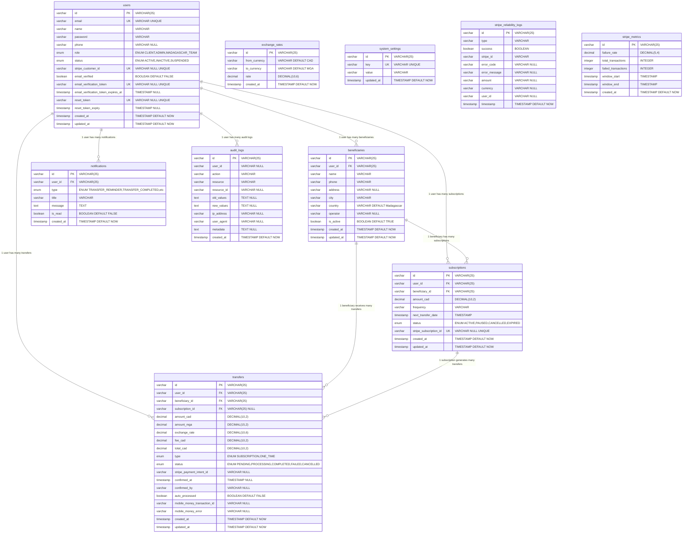

# Diagramme Entité-Relation - Base de Données

## Index Principaux

### 🔍 Utilisateurs (users)

- `email` (UNIQUE) - Connexion utilisateur
- `stripe_customer_id` (UNIQUE) - Intégration Stripe
- `email_verification_token` (UNIQUE) - Vérification email
- `reset_token` (UNIQUE) - Réinitialisation mot de passe

### 🔍 Transferts (transfers)

- `user_id` - Recherche par utilisateur
- `beneficiary_id` - Recherche par bénéficiaire
- `subscription_id` - Transferts d'abonnement
- `status` - Filtrage par statut
- `created_at` - Tri chronologique
- `stripe_payment_intent_id` - Intégration Stripe

### 🔍 Logs d'audit (audit_logs)

- `user_id` - Actions par utilisateur
- `action` - Type d'action
- `resource` - Type de ressource
- `created_at` - Tri chronologique

### 🔍 Monitoring Stripe (stripe_reliability_logs)

- `timestamp` - Tri chronologique
- `success` - Filtrage succès/échec
- `type` - Type de transaction

## Contraintes de Domaine

- **beneficiaries.country** : Toujours 'Madagascar'
- **exchange_rates.from_currency** : Toujours 'CAD'
- **exchange_rates.to_currency** : Toujours 'MGA'
- **users.email** : Format email valide
- **Montants** : Toujours positifs
